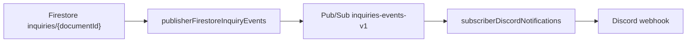

# anareg.design-messaging

Firebase Functions based messaging layer for anareg.design.

## Architecture

Firestore `inquiries/{documentId}` create/update events are published to
Google Cloud Pub/Sub topic `inquiries-events-v1`. The Discord subscriber
receives the Pub/Sub message and posts the inquiry to Discord.

Delete events are intentionally ignored.



## Functions

- `publisherFirestoreInquiryEvents`: Firestore publisher that writes
  normalized notification messages to `inquiries-events-v1`.
- `subscriberDiscordNotifications`: Discord destination subscriber that reads
  `inquiries-events-v1`, routes supported notification messages, and posts to
  Discord.

Runtime naming rules are part of the system specification:
[docs/spec/system.md](docs/spec/system.md).

## Delivery semantics

Pub/Sub and retry-enabled event handlers provide at-least-once delivery.
Messages include a stable `id` from the source event, so downstream
subscribers can add deduplication if needed. Exactly-once Discord posting is
not guaranteed.

## Notification payload

Pub/Sub messages use a common notification envelope so subscribers can be
shared across platforms and expanded without changing every publisher.

```json
{
  "schemaVersion": "1",
  "id": "source-event-id",
  "type": "inquiry.created",
  "source": "firestore.inquiries",
  "subject": "inquiries/{documentId}",
  "time": "2026-05-04T12:00:00.000Z",
  "target": "*",
  "notification": {
    "title": "New Inquiry",
    "body": "inquiries/{documentId}"
  },
  "metadata": {
    "correlationId": "source-event-id",
    "deduplicationKey": "firestore.inquiries:source-event-id",
    "producedAt": "2026-05-04T12:00:01.000Z"
  },
  "data": {
    "documentId": "{documentId}",
    "before": null,
    "after": {}
  }
}
```

`target` is a routing key for future subscriber behavior. Current Firestore
inquiry events are published with `target: "*"`, and the Discord subscriber
processes only `*`. Future targets can be used to route to different Discord
channels or other notification platforms.

## Local commands

Run commands from `functions/`.

```sh
npm ci
npm run lint:check
npm run build
npm test
```

Use `npm run lint:fix` only when you intentionally want ESLint to rewrite
files.

## Google Cloud setup

Create the Pub/Sub topic before deploying:

```sh
gcloud pubsub topics create inquiries-events-v1 \
  --project anaregdesign-455601
```

Grant the Functions runtime service account permission to publish to the
topic. Replace `PROJECT_NUMBER` if the project uses the default Cloud
Functions v2 runtime service account, or replace the whole service account
if a custom runtime identity is configured.

```sh
gcloud pubsub topics add-iam-policy-binding inquiries-events-v1 \
  --project anaregdesign-455601 \
  --member "serviceAccount:PROJECT_NUMBER-compute@developer.gserviceaccount.com" \
  --role "roles/pubsub.publisher"
```

Set the Discord webhook secret:

```sh
firebase functions:secrets:set DISCORD_WEBHOOK_INQUIRIES \
  --project anaregdesign-455601
```

## GitHub Actions CI/CD

The workflow in `.github/workflows/firebase-functions.yml` runs CI on PR and
push. Pushes to `main` deploy Firebase Functions with Workload Identity
Federation.

Individual runtime deploys use the role-prefixed Function names:

```sh
firebase deploy --only functions:publisherFirestoreInquiryEvents
firebase deploy --only functions:subscriberDiscordNotifications
```

Configure these GitHub repository variables:

- `GCP_PROJECT_ID`: `anaregdesign-455601`
- `GCP_WORKLOAD_IDENTITY_PROVIDER`: full Workload Identity Provider resource
  name
- `GCP_SERVICE_ACCOUNT`: deploy service account email

The deploy service account needs permission to deploy Firebase Functions and
act as the runtime/build service accounts. Do not use Service Account key JSON
for CI/CD.

## Repository rename

This repo is expected to be renamed from `anareg.design-functions` to
`anareg.design-messaging`.

After renaming the GitHub repository, update the local remote:

```sh
git remote set-url origin \
  https://github.com/anaregdesign/anareg.design-messaging
```
